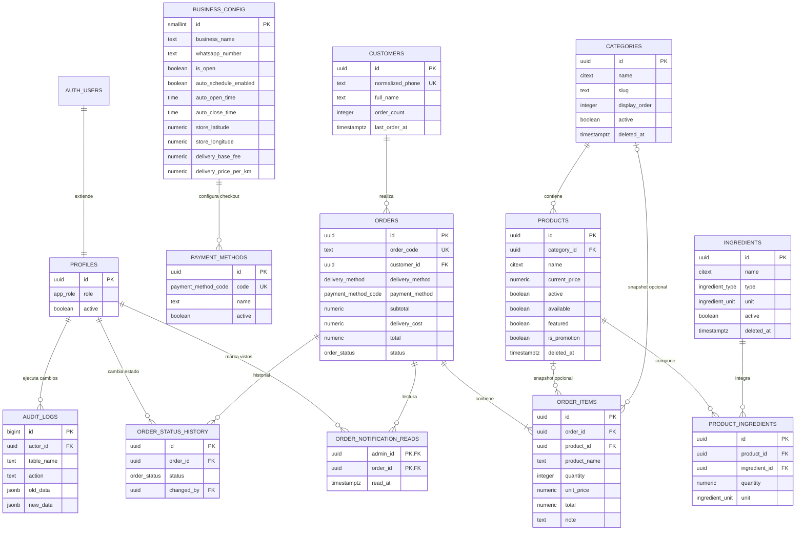

# Diagrama entidad–relación

## Decisiones importantes

- `orders` y `order_items` conservan snapshots para que un cambio posterior de producto no altere ventas anteriores.
- El carrito no se persiste en PostgreSQL: sigue siendo un borrador local hasta confirmar.
- `products`, `categories` e `ingredients` usan baja lógica; sus índices únicos parciales permiten reutilizar nombres después de una eliminación.
- Los pedidos públicos se crean mediante una RPC atómica; el navegador no inserta filas ni define precios directamente.
- `sales_ledger` es una vista administrativa de pedidos no cancelados, no el módulo futuro de reportes/exportaciones.
